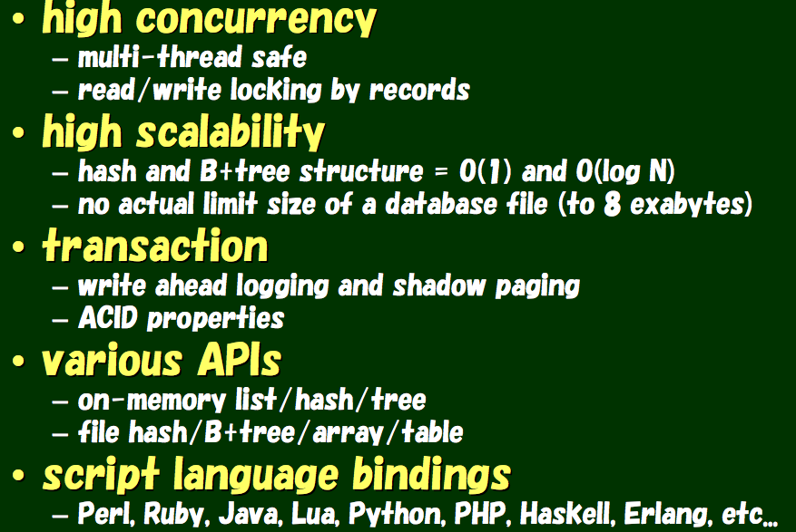
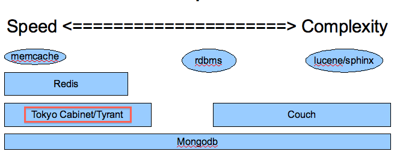

!SLIDE center
## Tokyo Cabinet, Tokyo Tyrant and Kyoto Cabinet: the world of Mikio ware ##

### Makoto Inoue (@makoto_inoue) ###
### http://tokyocabinetwiki.pbworks.com ###

!SLIDE bullets incremental
# Contents #

* What is MikioWare ?
* Tokyo Cabinet
* Tokyo Tyrant
* Kyoto Cabinet

!SLIDE center full-page

# What is MikioWare ? #

* Mikio Hirabayashi

!SLIDE center full-page

# What is MikioWare ? #

 Mikio Hirabayashi

!SLIDE center bullets incremental

# What is MikioWare ? #

* 13 million members (10% of the population)
* 2 million page views per day
* 10 K connections(= 10,000 QPS) at peak

!SLIDE bullets

# What is MikioWare ? #

* 2009 - **Kyoto Cabinet** (DBM)
* 2009 - Tokyo Promenade (CMS)
* 2008 - Tokyo Dystopia (Search)
* 2008 - **Tokyo Tyrant** (DB Server)
* 2007 - **Tokyo Cabinet** (DBM)

!SLIDE center bullets

# What is MikioWare ? #

* 2005 - Hyper Estraier (Search)
* 2003 - Estraier (Search)
* 2003 - QDBM (DBM)
* 200? - Snatcher (Search)

!SLIDE center bullets
# Tokyo Cabinet #

* Space and Time efficiency
* Multi Threaded
* Robustness
* Easy API

!SLIDE center bullets
# Tokyo Cabinet #

!SLIDE center
# Within NoSQL world #

!SLIDE center bullets 
# Tokyo Cabinet #
## Various DB Types ##

* Fixed Length
* Hash
* B+Tree
* Table

!SLIDE bullets incremental
# Tokyo Tryant (TT) #

* Network server 
* http / memcached compatible protocol
* Abstract API
* Lua extension

!SLIDE
# TT Abstract API #
## Startup Hash ##

[terminal-1]$ ttserver

!SLIDE
# TT Abstract API #
## Hash ##

$ tcrmgr put localhost one first
$ tcrmgr put localhost two second
$ tcrmgr put localhost three third
$ tcrmgr mget localhost one two three

one	first
two	second
three	third

# TT Abstract API #
## Startup Btree ##

[terminal-1]$ ttserver "+"
[~]$ tcrmgr misc localhost putlist one 1 one 2
[~]$ tcrmgr misc localhost getlist one
[~]$ tcrmgr misc localhost getlist one

!SLIDE
# TT Abstract API #
## Hash ##

$ tcrmgr put localhost one first
$ tcrmgr put localhost two second
$ tcrmgr put localhost three third
$ tcrmgr mget localhost one two three
one	first
two	second
three	third

!SLIDE code

# TT - Lua extension #
## Lua Extension ##

    @@@ javascript
    function enqueue(key, value)
       local id = _adddouble(key, 1)
       if not id then
          return nil
       end
       key = string.format("%s\t%012d", key, id)
       if not _putkeep(key, value) then
          return "not ok"
       end
       return "ok"
    end

!SLIDE code

# TT - Lua extension #

    @@@ javascript
    function dequeue(key, max)
       max = tonumber(max)
       if not max or max < 1 then
          max = 1
       end
       key = string.format("%s\t", key)
       local keys = _fwmkeys(key, max)
       local res = ""
       for i = 1, #keys do
          local key = keys[i]
          local value = _get(key)
          if _out(key) and value then
             res = res .. value .. "\n"
          end
       end
       return res
    end

!SLIDE bullets incremental
# Why do you use Tokyo Cabinet / Tokyo Tyrant?

* Disk as the New RAM
* C ++ ++
* Perl -- , Ruby --

!SLIDE bullets incremental
# Other projects which utilize TC/TT

* kumofs
* edamame
* Blitzdb

!SLIDE bullets incremental
# Kyoto Cabinet

* C ++
* May port into Windows
* Could become faster than TC with Ruby 1.9 + SSD

!SLIDE
# Kyoto Cabinet #

    @@@ ruby
    require 'kyotocabinet'
    include KyotoCabinet
    # process the database by iterator
    DB::process('casket.kch') { |db|
     # upcase values by iterator
     db.iterate { |key, value|
       value.upcase
     }
    }

