!SLIDE center
## Tokyo Cabinet, Tokyo Tyrant and Kyoto Cabinet: the world of MikioWare ##

### LRUG May 2010 ###

### Makoto Inoue (@makoto_inoue) ###

### http://tokyocabinetwiki.pbworks.com (@tcwiki) ###

!SLIDE bullets incremental

# Who am I ? #

* New Bamboo (@pandastream, @pusherapp)
* ex-DBA (MSSQL/Oracle/Sybase)
* dm-tokyo-cabinet-adapter (Don't use)
* http://tokyocabinetwiki.pbworks.com (@tcwiki)
* No production use yet

!SLIDE bullets incremental
# Contents #

* What is MikioWare ?
* Where is Tokyo in NoSQL world?
* What is TC/TT/KC ?
* What's exciting about them ?
* What about scaling ?

!SLIDE center full-page

# What is MikioWare ? #

## Mikio Hirabayashi ##

### http://1978th.net ###

!SLIDE center full-page

# What is MikioWare ? #

## Mikio Hirabayashi ##

### Loves computer games ###

!SLIDE center

# What is MikioWare ? #

#### ついに発売されたスト4のコンシューマ機版をやりたくてしょうがないけど筐体を買ってもらえないので、駅前のゲーム屋のディスプレー前で垂涎するばかりのmikioです。今回は連載の最終回で、各種スクリプト言語を使ってお手軽にテーブルデータベースを操作する方法について説明します。####

### I really want to play "Street Fighter 4", but my wife doesn't let me buy one. Today, I will show you how to use table database using various language binding.####

#### (http://1978th.net/tech/promenade.cgi?id=21) ####

!SLIDE center bullets incremental

# What is MikioWare ? #

#### 従来はmemcachedで分散させて最終ログイン時刻を管理していました...たった1台のTTに集約させて保持しています...150億PVを1台に集約させるって結構すごいことだなと我ながら思います...セッションデータのような小さいレコードを多数管理するようなユースケースでは分散でなく集中させることでコストを下げるという選択肢もあるということです。
### I recently moved several memcached based login timestamp recording system into single TT. Managing 15 BILLION PV with ONE machine sounds incredible. For certain cases, CONCENTRATED approach may work better than DISTRIBUTED approach.

#### (http://1978th.net/tech/promenade.cgi?id=72) ####

!SLIDE center bullets incremental

# What is MikioWare ? #

* 13 million members
* (10% of the Japanese population)
* 15 billion page views per month
* 50 K query per second at peak

!SLIDE full-page

# Mixi footprint page #

!SLIDE bullets

# What is MikioWare ? #

* 2009 - **Kyoto Cabinet** (DBM)
* 2009 - Tokyo Promenade (CMS)
* 2008 - Tokyo Dystopia (Search)
* 2008 - **Tokyo Tyrant** (DB Server)
* 2007 - **Tokyo Cabinet** (DBM)

!SLIDE center 
# Where is Tokyo in NoSQL world? #

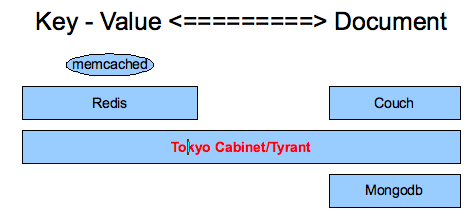

!SLIDE full-page 
# Key - Value ?#

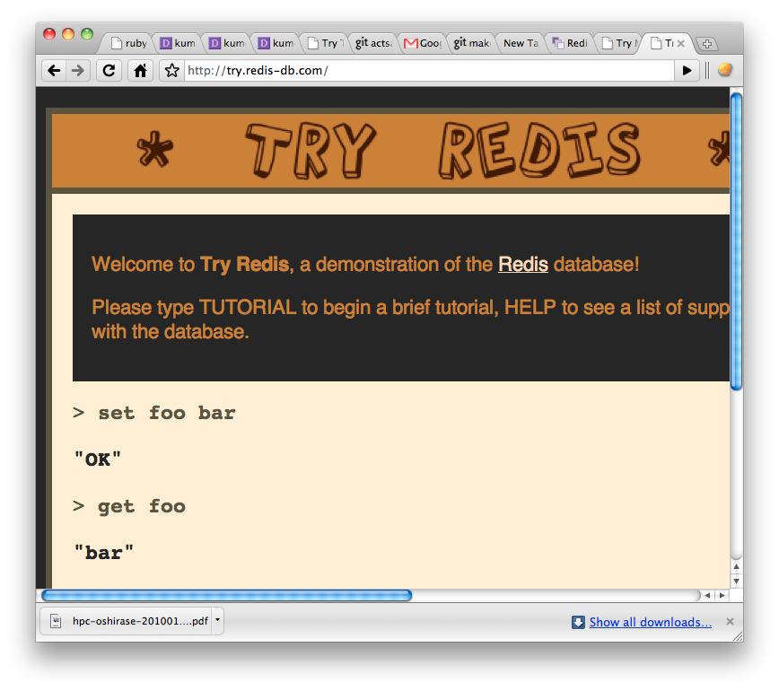

!SLIDE full-page
# Key - Value = Hash #

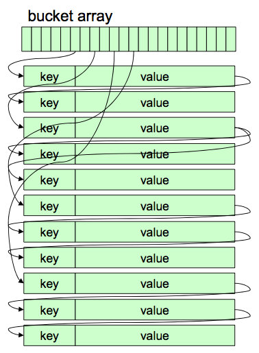
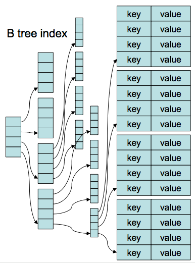

!SLIDE bullets incremental
# Key - Value ?#

* Hash index = O(1)
* Long key, small value eg: "http://yourapp.com/products/iphone" => 1
* Not good for range/sort (against keys)
* Some RDBMS uses hash index for join

!SLIDE full-page 

# Document ?#

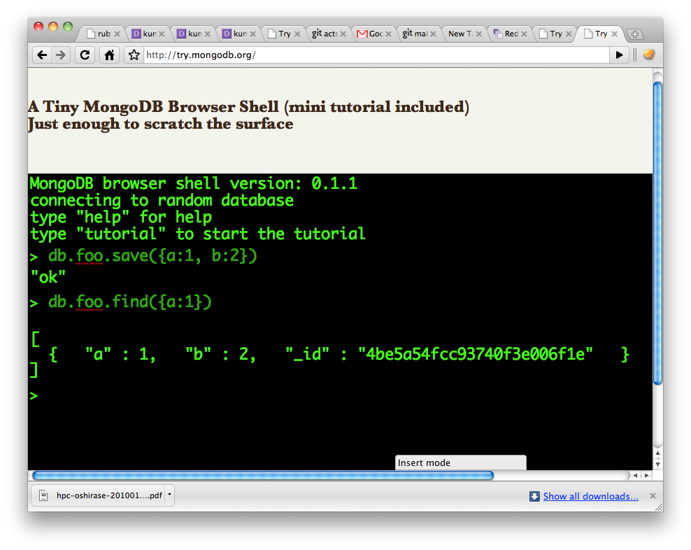

!SLIDE bullets incremental
# Document ? #

* Mainly B+Tree index = O(logN)
* MapReduce = Can be parallelised 
* Search by key & value
* Can be nested {:a => {:b => 1}}

!SLIDE center bullets incremental

# What is TC/TT/KC 

* Tokyo Cabinet = Key-Value, or Document. Memory or File 
* Tokyo Tyrant = Network Server (w memcached/http protocol support)
* Kyoto Cabinet = Sibling of TC (C++), Windows support 

!SLIDE center
# TC - Various Data Structure

!SLIDE full-page
# TCHDB - Hash #

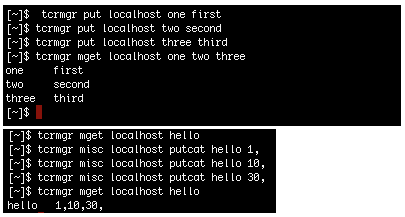

!SLIDE center
# TCHDB - Hash #

    @@@ ruby
    require 'tokyo_tyrant'
     db = TokyoTyrant::DB.new('127.0.0.1', 1978)

     db['foo'] = 'Bar' # => "Bar"
     db['foo']         # => "Bar"

     db.each{ |k,v| puts [k, v].inspect }
     # ["foo", "Bar"]
     # => nil

     db.mput("1"=>"number_1", "2"=>"number_2", "3"=>"number_3", "4"=>"number_4", "5"=>"number_5")
     db.mget(1..3) # => {"1"=>"number_1", "2"=>"number_2", "3"=>"number_3"}

!SLIDE full-page
# TCFDB - Fixed (= Array) #

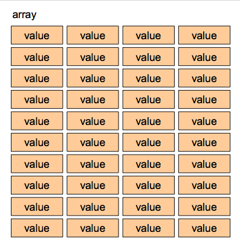
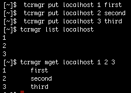

!SLIDE full-page
# TCBDB - B+ Tree
## dupilcate, range, forward key matching

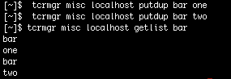

!SLIDE center
# TCBDB - B+ Tree

    @@@ ruby
    require 'tokyo_tyrant'
    bdb = TokyoTyrant::BDB.new('127.0.0.1', 1978)

    bdb.putdup('foo', 'bar')
    # => true

    bdb.putlist({ 'foo' => ['baz', 'bat']})
    # => []

    bdb.getlist('foo')
    # => {"foo"=>["bar", "baz", "bat"]}

    bdb.each{ |k,v| puts [k, v].inspect }
    # ["foo", "bar"]
    # ["foo", "baz"]
    # ["foo", "bat"]

!SLIDE full-page
# TCTDB - Table

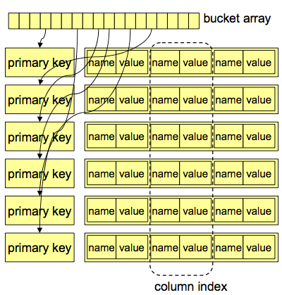
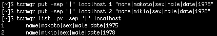

!SLIDE center
# TCTDB - Table

    @@@ ruby
    require 'tokyo_tyrant'
    t = TokyoTyrant::Table.new('127.0.0.1', 1978)

    100.times do |i|
      t[i] = { 'name' => "Pat #{i}", 'sex' => i % 2 > 0 ? 'male' : 'female' }
    end
    # Get records for a query
    t.find{ |q|
      q.condition('sex', :streq, 'male')
      q.limit(5)
    }

!SLIDE center
# Ruby Bindings #

### Official bindings (tokyocabinet/tokyotyrant) ###
### * ruby-tokyotyrant ###
### oklahoma_mixer  ###
### rufus-tokyo(retired) ###

!SLIDE center bullets incremental
# What's exciting about them ? #

* Speed
* Disk as Memory
* Extendable

!SLIDE full-page

!SLIDE full-page
# Speed #
### Request Per Second for read/write 1-5,000,000 records ###
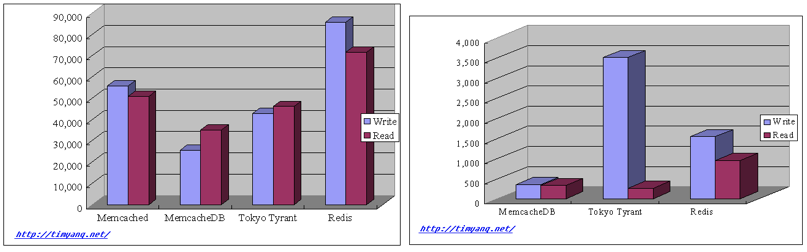
### http://timyang.net/data/mcdb-tt-redis ###

!SLIDE center bullets incremental
# Disk as Memory #

* Memcache your fragment cache(Ravelry, 100 mil pvpm)
* Poor mans Memcache on VPS?
* Temporary store for your batch job
* (http://github.com/jubos/meguro)

!SLIDE center

# Extendable (Tokyo Tyrant Lua) #

    @@@ javascript
    function incr(key, value)
       local old = tonumber(_get(key))
       if old then
        value = value + old
       end
       if not _put(key, value) then
          return nil
       end
       return value
    end

!SLIDE full-page
# Extendable (Tokyo Tyrant Lua) #
### server ###
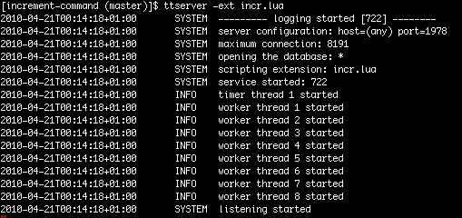
### client ###
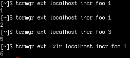

### http://www.igvita.com/2009/07/13/extending-tokyo-cabinet-db-with-lua ###

!SLIDE center
# Extendable (Kyoto Cabinet) #

    @@@ ruby
    def db.incr(keyword, number)
      self.accept(keyword, nil, true) { |key, value|
        new_value = key ? value.to_i + number : number
        p new_value
        new_value
      }
    end

!SLIDE center
# Extend (w Kyoto Cabinet) #

    @@@
    irb(main):209:0> db.incr("foo",1)
    2
    => true
    irb(main):227:0> db.echo("hello")
    "hello"
    => true
    
### http://1978th.net/kyotocabinet/rubydoc ###

!SLIDE center bullets incremental
# What about scaling ? #

* ruby-tokyotyrant 
* Kumofs
* ROMA

!SLIDE full-page
# ruby-tokyotyrant #

    @@@ruby
     require 'tokyo_tyrant/balancer'
     servers = ['127.0.0.1:1978',
                '127.0.0.1:1979',
                '127.0.0.1:1980']

     tb = TokyoTyrant::Balancer::Table.new(servers)

     # store server is determined by key which is consistent
     tb[:foo] = { 'foo' => 'bar' }
     tb[:bar] = { 'bar' => 'baz' }

     # parallel_search based querying across all nodes
     tb.find{ |q| q.condition(:foo, :streq, 'bar') }

!SLIDE center bullets incremental
# Kumofs #
### http://github.com/etolabo/kumofs  ###

* C++ (management tools written in ruby)
* memcached compatible
* automatic replication

!SLIDE center bullets incremental
# ROMA #
### http://github.com/roma/roma ###

* Written in Ruby (Matz is involved)
* on-memory or Tokyo Cabinet
* p2p

!SLIDE full-page
# Kumofs vs ROMA #

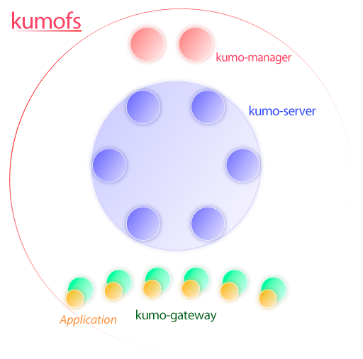
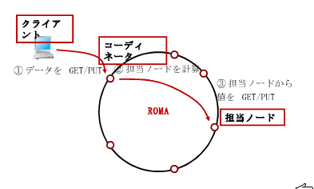

!SLIDE bullets incremental
# Conclusion #

* Key Value - Document
* Performance and Scalability
* Why should you care about NoSQL ?

!SLIDE center bullets incremental
# Studying further #

* http://tokyocabinetwiki.pbworks.com
* http://github.com/makoto/tokyo_private_teacher
* http://github.com/makoto/try_tokyo

!SLIDE full-page

# Thanks!!

## Follow @tcwiki ##