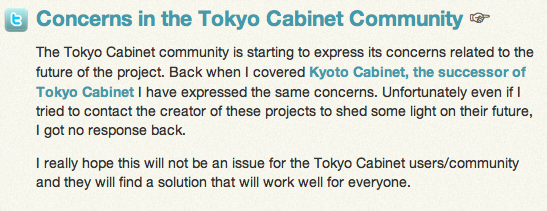
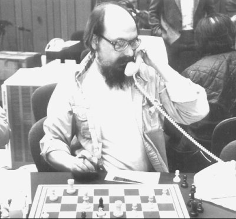
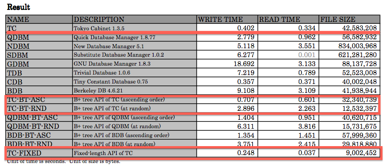
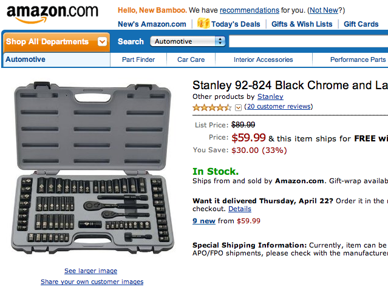

!SLIDE center
## Tokyo Cabinet, Tokyo Tyrant and Kyoto Cabinet: the world of MikioWare ##

### Makoto Inoue (@makoto_inoue) ###

### http://new-bamboo.co.uk (@newbamboo) ###

### http://tokyocabinetwiki.pbworks.com (@tcwiki) ###

!SLIDE center 

### http://nosql.mypopescu.com ###

!SLIDE bullets incremental
# Contents #

* What is MikioWare ?
* What is TC/TT/KC
* What's exciting about them?
* Interesting projects which uses TC?

!SLIDE center full-page

# What is MikioWare ? #

## Mikio Hirabayashi ##

### http://1978th.net ###

!SLIDE center full-page

# What is MikioWare ? #

## Mikio Hirabayashi ##

### Loves computer games ###

!SLIDE center

# What is MikioWare ? #

#### ついに発売されたスト4のコンシューマ機版をやりたくてしょうがないけど筐体を買ってもらえないので、駅前のゲーム屋のディスプレー前で垂涎するばかりのmikioです。今回は連載の最終回で、各種スクリプト言語を使ってお手軽にテーブルデータベースを操作する方法について説明します。####

### I really want to play "Street Fighter 4", but my wife doesn't let me buy one. Today, I will show you how to use table database using various language binding.####

#### (http://1978th.net/tech/promenade.cgi?id=21) ####

!SLIDE center bullets incremental

# What is MikioWare ? #

#### 従来はmemcachedで分散させて最終ログイン時刻を管理していました...たった1台のTTに集約させて保持しています...150億PVを1台に集約させるって結構すごいことだなと我ながら思います...セッションデータのような小さいレコードを多数管理するようなユースケースでは分散でなく集中させることでコストを下げるという選択肢もあるということです。
### I recently moved several memcached based login timestamp recording system into single TT. Managing 15 BILLION PV with ONE machine sounds incredible. For certain cases, CONCENTRATED approach may work better than DISTRIBUTED approach.

#### (http://1978th.net/tech/promenade.cgi?id=72) ####

!SLIDE center bullets incremental

# What is MikioWare ? #

* 13 million members
* (10% of the Japanese population)
* 15 billion page views per month
* 50 K query per second at peak

!SLIDE bullets

# What is MikioWare ? #

* 2009 - **Kyoto Cabinet** (DBM)
* 2009 - Tokyo Promenade (CMS)
* 2008 - Tokyo Dystopia (Search)
* 2008 - **Tokyo Tyrant** (DB Server)
* 2007 - **Tokyo Cabinet** (DBM)

!SLIDE center bullets

# What is MikioWare ? #

* 2005 - Hyper Estraier (Search)
* 2003 - Estraier (Search)
* 2003 - QDBM (DBM)
* 200? - Snatcher (Search)

!SLIDE center bullets

# What is DBM ? #

### 1979 - DBM

!SLIDE center bullets incremental

# What is TC/TT/KC 

* Tokyo Cabinet = List, K-V, or Table store. Memory or File 
* Tokyo Tyrant = Network Server (for web, memcached, http, lua)
* Kyoto Cabinet = Sibling of TC (C++), Pluggable, Windows support 

!SLIDE center
# TC - Various Data Structure

!SLIDE
# TCHDB - Hash #

!SLIDE
# TCFDB - Fixed (= Array) #

!SLIDE 
# TCBDB - B+ Tree
## dupilcate, range, forward key matching

!SLIDE
# TCTDB - Table

!SLIDE center
# Ruby Binding Example

    @@@ ruby
    require 'tokyo_tyrant'
    t = TokyoTyrant::Table.new('127.0.0.1', 1978)

    100.times do |i|
      t[i] = { 'name' => "Pat #{i}", 'sex' => i % 2 > 0 ? 'male' : 'female' }
    end
    # Get records for a query
    t.find{ |q|
      q.condition('sex', :streq, 'male')
      q.limit(5)
    }

!SLIDE center bullets incremental
# What's exciting about them ? #

* Speed
* Disk as Memory
* Extensible database
* Tools, not Framework

!SLIDE center bullets incremental
# What's exciting about TC? #
## Speed ##
### Storing 1,000,000 records ###

### http://1978th.net/tokyocabinet/benchmark.pdf ###
!SLIDE center bullets incremental
# What's exciting about TC? #
## Speed ##
### Request Per Second for read/write 1-5,000,000 records ###

### http://timyang.net/data/mcdb-tt-redis ###

!SLIDE center bullets incremental
# What's exciting about TC? #

## Disk as Memory ##

## "I’ve been using Tokyo Cabinet/Tyrant instead of memcached in some places for caching larger objects. We do a lot of rendering Markdown into HTML — pretty much everywhere on the site — it’s a waste of energy to render but it’s also a huge amount of data to store in memcached."  ##

### http://tokyocabinetwiki.pbworks.com/01_CaseyForbesFromRavelry ###

!SLIDE center bullets incremental
# What's exciting about TC? #

## Extensible database ##

    @@@ javascript
    function incr(key, value)
       value = tonumber(value)
       if not value then
          return nil
       end
       local old = tonumber(_get(key))
       if old then
          value = value + old
       end
       if not _put(key, value) then
          return nil
       end
       return value
    end

!SLIDE center bullets incremental
# What's exciting about TC? #

### server ###

### client ###

### http://www.igvita.com/2009/07/13/extending-tokyo-cabinet-db-with-lua ###

!SLIDE center bullets incremental
# What's exciting about TC? #

## Tools, not Framework ##

!SLIDE center bullets incremental
# Interesting projects which uses TC? #

* Distributed K-V = kumofs/ROMA
* Queuing = Edamame (beanstalkd with persistency)
* RDBMS = BlitzDB(Drizzle Engine)

!SLIDE center bullets incremental
# Thanks!!

## Follow @tcwiki ##